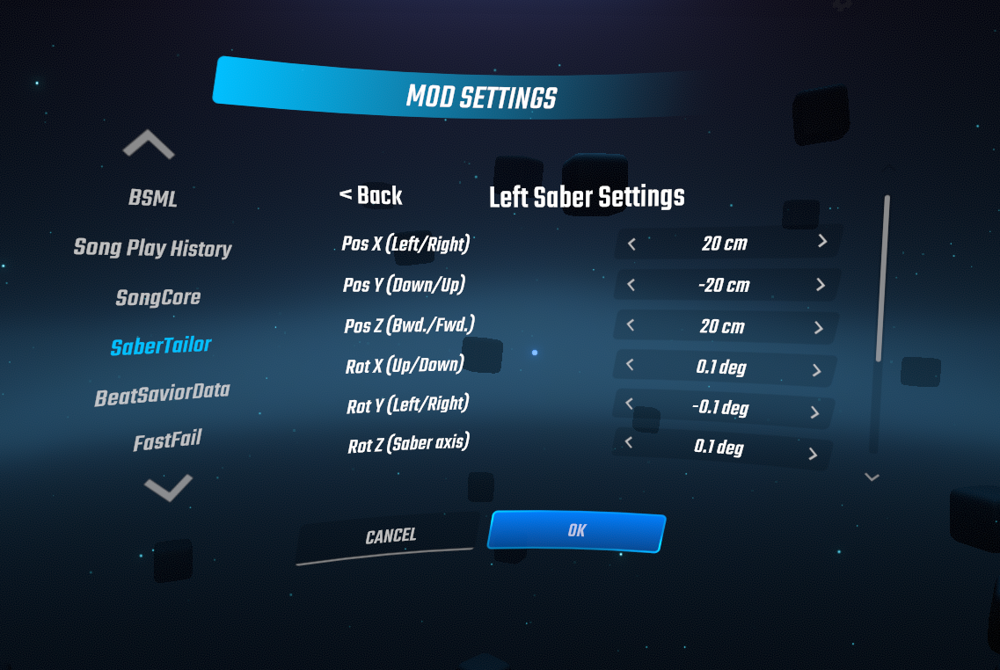

## 日本語版READMEは[こちら](README_JP.md)

# (Improved) Saber Tailor

## How to install
1. Download SaberTailor.dll from [Releases](https://github.com/rakkyo150/BeatSaber-SaberTailor/releases)
2. Add SaberTailor.dll to the Plugins folder under the Beat Saber installation folder

For the Steam version of Beat Saber, the location of the Plugin folder is 
C:\Program Files (x86)\Steam\steamapps\common\Beat Saber\Plugins
is the default.  
Just in case.

## Differences from the [original version](https://github.com/Shadnix-was-taken/BeatSaber-SaberTailor)

1. More fine-tuned settings for saber position, angle and world offset
2. Extended limits for saber position and world offset. 3.
3. Improved UI.
4. Fixed UI bug in world offset Y and Z.

## About 1
Saber position and angle and world offset can now be adjusted to the decimal point.

## Adjustment methods
The following methods support adjustment to the second decimal place.  
**For adjustments to the third decimal place and below, please go to Beat Saber/UserData/SaberTailor.json.**  
In addition to the changes made in this article, other parts are omitted from the explanation.   
Please understand.

(1) 
Select Settings from the main menu.

(2) 
Select MOD SETTINGS.

(3)  
Scroll down and select Saber Grip Positions/Rotation...

(4) 
Scroll down and select Precision and other settings...

(5) 
The Saber Position Inc. Digit and Saber Rotation Inc. Digit are the parts where you can select the digit to increase or decrease.  
You can choose from 0.01/0.1/1/10/100.  
The units are cm and degree.  
The Saber Position Increment and Saber Rotation Increment are the parts that determine how much to increase or decrease each time.   
Basically you not need to tweak them. (In the image, Saber Position Increment is tweaked.) 
For example, if the Saber Position Inc. Digit is set to 100 cm in the image, the Saber Position Increment will automatically be set to 200 cm.

(6) 
To set up the left saber, select <back and then select Left Saber Settings.  
To configure the right saber settings, select Right Saber Settings.

(7) 
The images have been increased or decreased once for each.  
The settings in (5) are reflected.   
The formula is also shown here.  
Pos or World Offset=(Saber Position Inc. Digit x Number of clicks of Saber Position Increment) x Number of clicks of Saber Setting 
Rot=(Saber Rotation Inc. Digit x Saber Rotation Increment clicks) x Saber Setting clicks

(8) 
For World Offset, Saber Position increment is used.  
The image shows the X, Y, and Z of the World Offset being incremented or decremented once each.  
MIRROR TO RIGHT allows the right saber to reflect the settings of the left saber.  
If you press REVERT, it will mean that there was no change in the settings of the left saber.   
Press OK to complete the setting.
Note that pressing CANCEL, on the other hand, will mean that no changes were made to the settings of the entire SaberTailor.

By the way, if you want to display and adjust the actual saber, install [Custom Saber](https://twitter.com/nalulululuna/status/1406288209093435398), which is currently developed by naluluna, and click Show Saber in Menu Always should be enabled.

## About 2
Saber position and world offset limits have been extended from 50cm to 500cm (5m).

## About 3
Added a heading to the submenu.  
The back button to the main menu has been placed at the top left of the submenu.  
The back button is also placed in the lower left corner of the submenus that have scrolling.  
Revert button and Mirror to Left/Right button are now easier to understand.

## About 4
There was a bug in the original that prevented the world offset Y and Z from being changed in the UI (as of 6/21/2021).  
This has been fixed.
