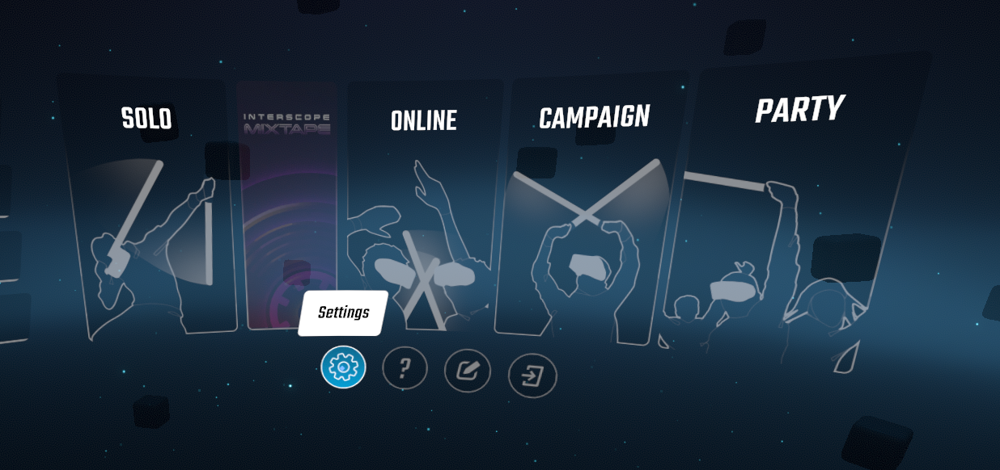
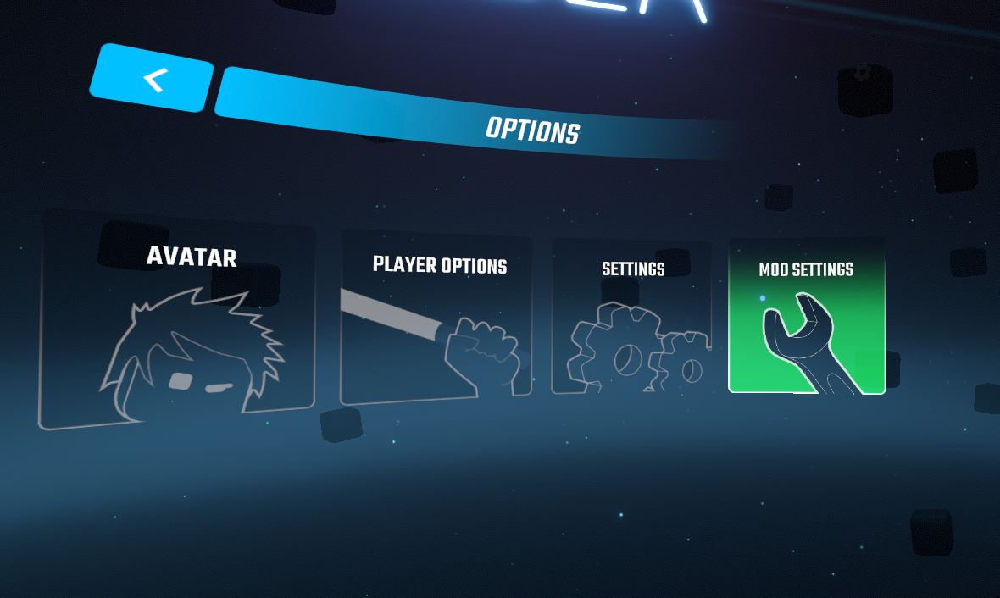
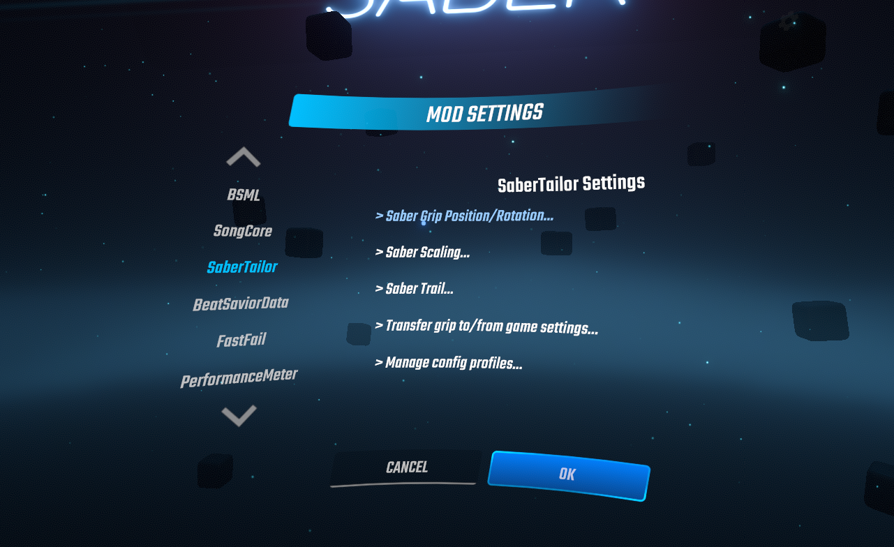
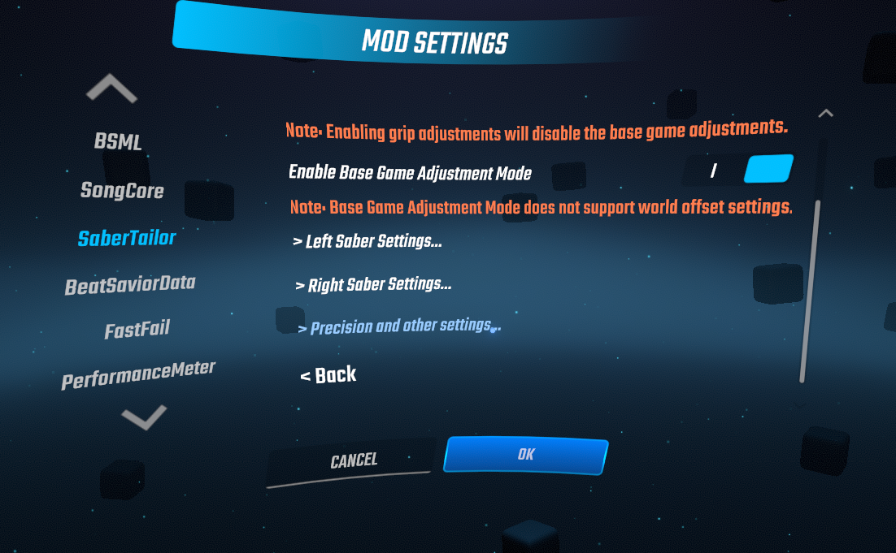
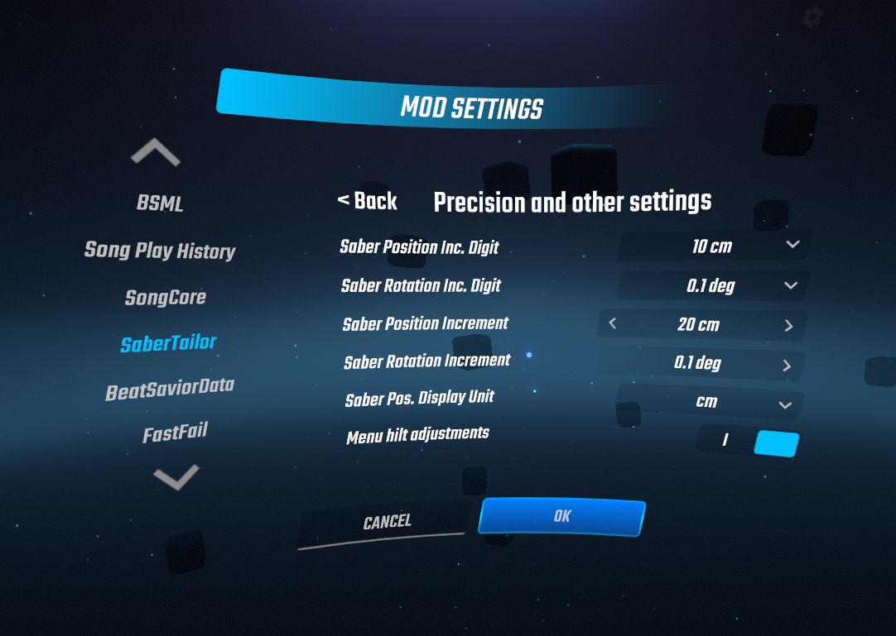
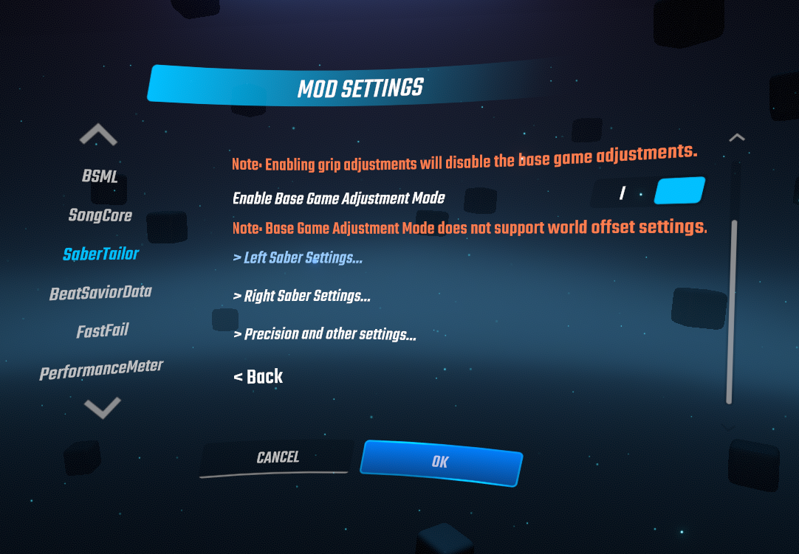

## The English version of README is [here](README.md)

# Saber Tailor 改良版

## 導入方法
1. [Releases](https://github.com/rakkyo150/BeatSaber-SaberTailor/releases)からSaberTailor.dllをダウンロード
2. SaberTailor.dllをBeat Saberのインストールフォルダ下のPluginsフォルダに追加

Steam版Beat Saberの場合、Pluginフォルダの場所は 
C:\Program Files (x86)\Steam\steamapps\common\Beat Saber\Plugins 
がデフォルトになっています。 
念のため。

## [オリジナルバージョン](https://github.com/Shadnix-was-taken/BeatSaber-SaberTailor)との違い

1. セイバーの位置と角度とワールドオフセットのより細かな設定が可能に
2. セイバーの位置とワールドオフセットの上限を拡張
3. UIの改善
4. ワールドオフセットのYとZにおけるUIのバグを修正

## １について
セイバーの位置と角度とワールドオフセットの小数点以下の調整を可能にしました。

### 調整方法
以下の方法は少数第二位までの調整に対応しています。 
**少数第三位以下の調整はBeat Saber/UserData/SaberTailor.jsonから行ってください。** 
また、今回変化を加えた部分以外の部分については説明を省きます。 
ご了承ください。

(1) 
ビーセイのメインメニューのSettingsを選択します。

(2) 
MOD SETTINGSを選択します。

(3) 
下にスクロールしてSaber Grip Positions/Rotation...を選択します。

(4) 
下にスクロールしてPrecision and other settings...を選択します。

(5) 
Saber Position Inc. DigitとSaber Rotation Inc. Digitは、増減を行う桁を選択する部分になります。 
0.01/0.1/1/10/100から選べます。 
単位はそれぞれcmと°です。 
Saber Position IncrementとSaber Rotation Incrementは１回あたりどれだけ増減を行うかを決まる部分になります。 
基本的にはいじる必要はないと思います。(画像ではいじってますが) 
また、IncrementはInc Digitの影響を受けるので、例えば画像でSaber Position Inc. Digitを100 cmにしたら、自動的にSaber Position Incrementも200 cmになります。

(6) 
左のセイバーの設定をするため<backを選択して、Left Saber Settingsを選択します。 
右のセイバーの設定をする場合はRight Saber Settingsを選択してください。

(7) 
画像はそれぞれに１回ずつ増減を加えたものになっています。 
⑤の設定が反映されていますね。 
一応計算式も置いておきます。 
Pos or World Offset=(Saber Position Inc. Digit×Saber Position Incrementのクリック数)×Saber Settingのクリック数 
Rot=(Saber Rotation Inc. Digit×Saber Rotation Incrementのクリック数)×Saber Settingのクリック数

(8) 
World OffsetについてはSaber Position incrementが使用されます。 
画像はWorld OffsetのX,Y,Zにそれぞれ１回ずつ増減を加えたものです。 
MIRROR TO RIGHTで右のセイバーに左のセイバーの設定を反映させることができます。 
REVERTを押すと左のセイバーの設定がすべて０に戻ります。 
OKを押せば設定が完了します。

ちなみに、実際のセイバーを表示して調整したい場合は、現在はnalulunaさんが開発している[Custom Saber](https://twitter.com/nalulululuna/status/1406288209093435398)を導入してShow Saber in Menu AlwaysをEnableにしましょう。

## ２について
セイバーの位置とワールドオフセットの上限を50cmから500cm(5m)まで拡張しました。

## ３について
サブメニューに見出しをつけました。 
また、メインメニューに戻るボタンをサブメニューの左上に配置しました。 
スクロールがあるサブメニューには左下にも戻るボタンを配置しました。 
RevertボタンとMirror to Left/Rightボタンを分かりやすくしました。

## ４について
オリジナルではワールドオフセットのYとZをUIで変更することができないバグがありました(2021/6/21現在)。 
これを修正しました。
